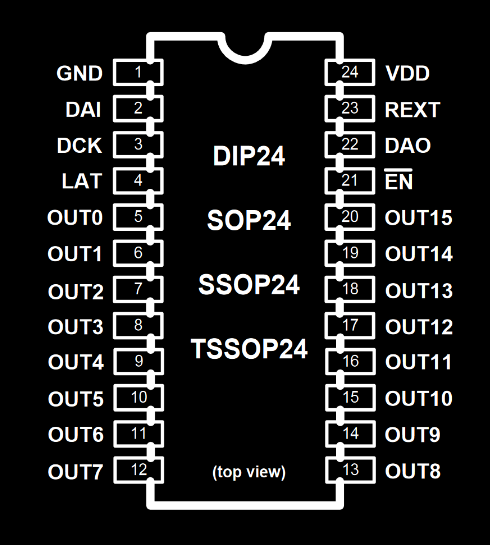
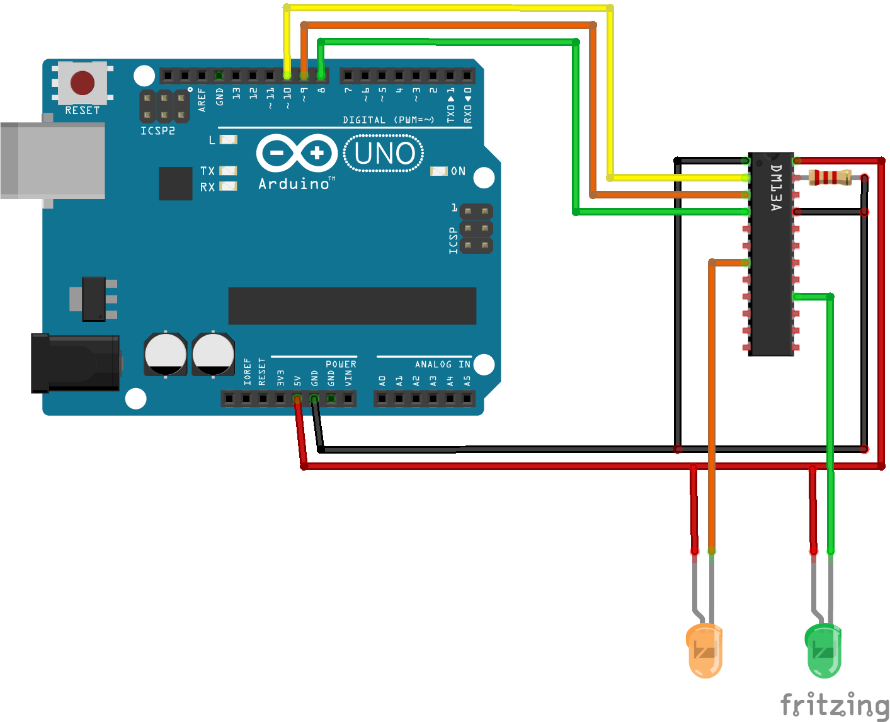
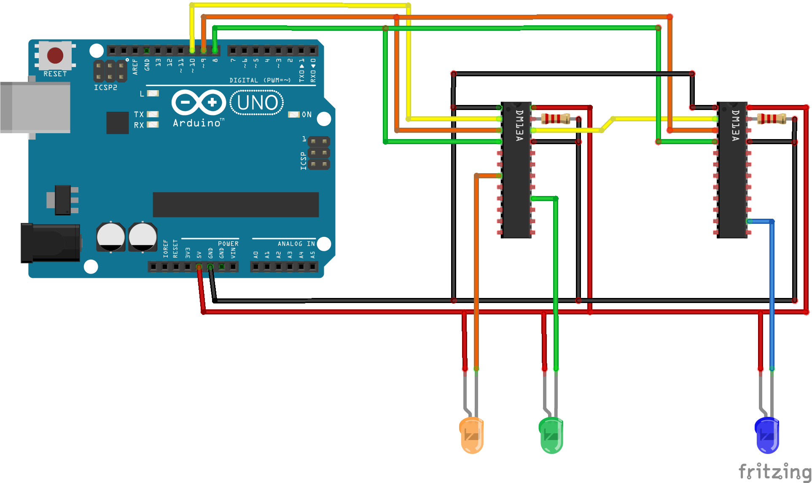
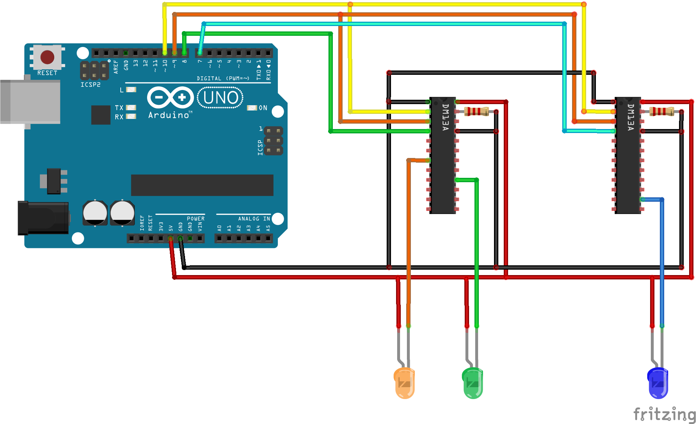

# DM13A
## Pin arrangement

## Single chip
Connecting a single chip needs three digital output pins to work. 
### Basic hardware setup:

1. `GND`(1) connected to Ground
1. `DAI`(2), `DCK`(3), `LAT`(4) connected to digital output pins *(here 10, 9 and 8 respectively)*
1. `OUT0`(5) to `OUT15`(20) connected to LED cathodes[\-] *(or not connected)*
1. `EN`(21) connected to Ground
1. `DAO`(22) not connected *(or alternatively grounded)*
1. `REXT`(23) connected to ground through a resistor
1. `VDD`(24) connected to +5V

### Initialisation of the chip:
```c
dm13a chip;
_b16_t data;

dm13a_init(&chip, 10, 9, 8, 1, &data);  // 1, because we have just one chip
```

### Managing LED states
```c
dm13a_setbits(&chip, 0, (_b16_t)0b0000000000000000);  // will turn all off
dm13a_setbit(&chip, 2, 1);  // will turn orange LED (OUT2) on
dm13a_setbits(&chip, 0, (_b16_t)0b0000000000010000);  // will turn all except green (OUT11) off
dm13a_setbit(&chip, 2, 1);  // will turn orange LED (OUT2) on again

dm13a_flush(&chip);  // will display the changes made (both LEDs will light up)
```
***IMPORTANT:*** Changes are not displayed until `dm13a_flush` is executed

## Chain connection
Connecting multiple chips in chain needs three digital output pins to work, same as with single chip. Any number of DM13As can be connected in chain (although numbers over 4 haven't been tested yet).

### Basic hardware setup:

1. `GND`(1), `DCK`(3), `LAT`(4), `EN`(21) and `VDD`(24) are connected together, similarly to one chip situation
1. `REXT`(23) connected to Ground through resistors **(each chip has to have its own resistor)**
1. First chip's `DAI`(2) is connected to chosen digital output pin
1. N-th chip's `DAI`(2) is connected to (N-1)th chip's `DAO`(22)
1. Last chip's `DAO`(22) remains not connected

### Initialisation of the chips:
Chain of DM13As is mostly treated like one, longer chip.
```c
dm13a chip;
_b16_t data[2];  // now we need a longer buffer

dm13a_init(&chip, 10, 9, 8, 2, data);  // 2, because now we have two chips in the chain
```

### Managing LED states
```c
dm13a_setbits(&chip, 0, (_b16_t)0b0000000000000000);  // will turn whole 1st chip off
dm13a_setbit(&chip, 2, 1);  // will turn orange LED (OUT2) on
dm13a_setbit(&chip, 11, 1);  // will turn green LED (OUT11) on
dm13a_setbits(&chip, 1, (_b16_t)0b1111111111111111);  // will turn whole 2nd chip on
dm13a_setbit(&chip, 25, 0);  // will turn blue LED (OUT9 of 2nd chip) off

dm13a_flush(&chip);  // will display the changes made (orange and green on)
```

## Parallel connection
Connecting N chips in parallel needs (N+2) digital output pins to work. Generally speaking, using serial connection is recommended.

### Basic hardware setup:

1. `GND`(1), `DAI`(2), `DCK`(3), `EN`(21) and `VDD`(24) are connected together, similarly to one chip situation
1. Each chip has `LAT`(4) connected to own digital output pin
1. `REXT`(23) connected to Ground through resistors **(each chip has to have its own resistor)**

### Initialisation of the chips:
Each chip is treated just like it was an independent singular chip.
```c
dm13a chip1, chip2;
_b16_t data1, data2;

dm13a_init(&chip1, 10, 9, 8, 1, &data1);
dm13a_init(&chip2, 10, 9, 7, 1, &data2);
```
Further operation can be performed independently *(however, can't be done concurrently in the same time due to usage of two common pins)*.

## Mixed connection
It is possible to connect multiple chains of chips in parallel manner.
