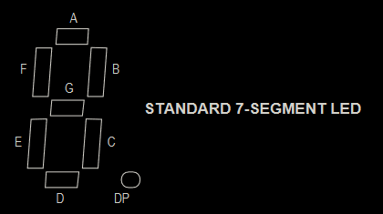
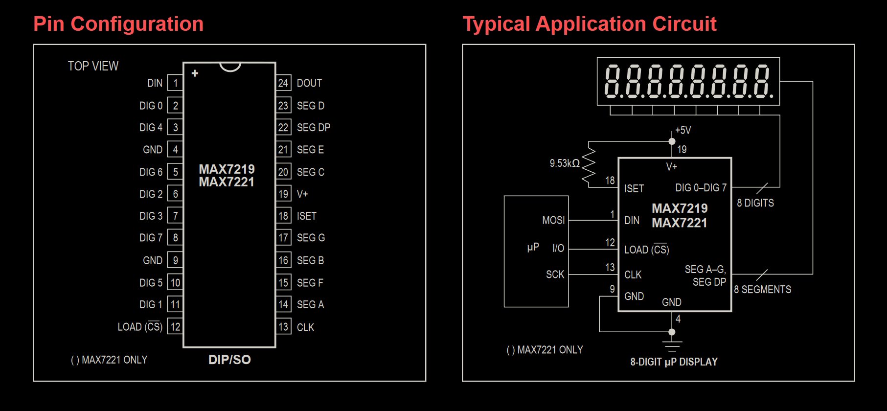
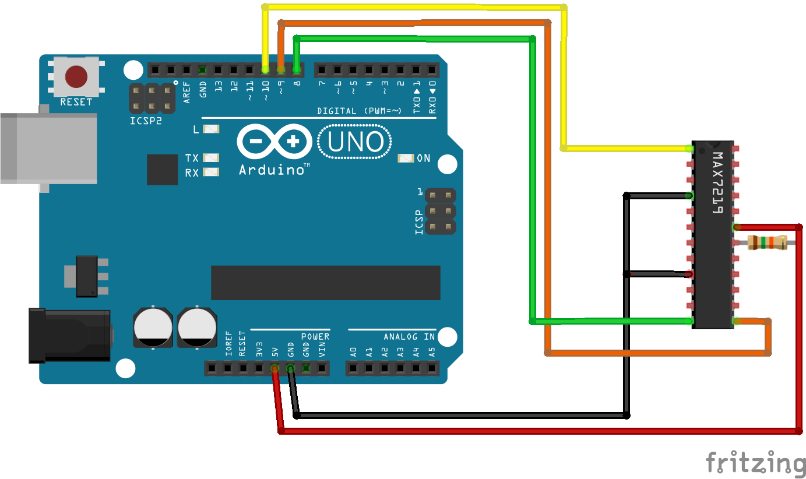
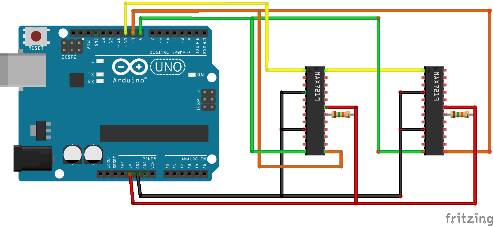
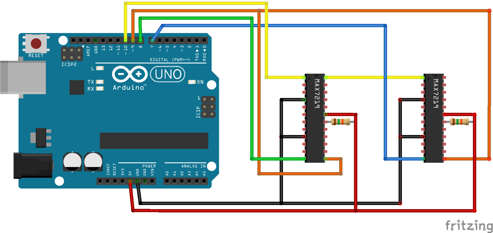

# MAX7219
## Introduction
7-segment displays usually have one or two sets of `A`, `B`, `C`, `D`, `E`, `F`, `G` and `DP (Decimal Point)` pins responsible for segments; the remaining pins correspond to particular digits.


Such displays can be of two types - with common **anodes** or **cathodes**. Currently only the latter is supported - when `A` pin is connected to +5V and a digit's pin is connected to Ground, this digit's `A` segment will light up.
### How to know our display's pins
Easy way is to have a documentation. However, when there is none (or if we want to verify its correctness), it is possible to easily test the pins:
1. We will need a power source, a resistor (any, for example 1kΩ) and cables
1. ...and pen and paper, not to forget the pin arrangement
1. Connect one chosen pin to `+`, and anther one **through a resistor** to `-`
1. Change pins up to the point where one segment lights up - the pin connected to `+` is responsible for the segment, `-` for the digit
1. Now change just the `+` connection - other segments of the same digit should light up
1. Repeat the previous step, but change just the `-` connection - same segment of other digits should light up
1. Now we know which pin is each
    * If previous two points work the other way around (changing the `+` connection changes digits, not segments), the tested display is unfortunately a *common anode* type and cannot be used (at least for now).
    * Some displays have multiple sets of segment pins, one for each digit - there will be an `A` pin per each digit, a `B` pin for each and so on.
### How to connect a display to MAX7219
* Connect the display's `A` segment pin to the chip's `SEG A` pin. Similarly `B` to `SEG B` and so on (`SEG DP` should be connected to the display's segment pin responsible for dots).
* Connect the display's pin responsible for the **rightmost** digit to the chip's `DIG 0` pin, second rightmost to `DIG 1` and so on. If there is fewer than 8 digits, some of the chip's pins may remain disconnected (e.g. if there is a 4-digit display and a 2-digit one, the first one may be connected to `DIG 1`-`DIG4` and the second one to `DIG 6` and `DIG 7`).
### Choosing RSET
While connecting MAX7219 to a microcontroller, there will be one resistor needed for each chip used. It can be anywhere between 9.53kΩ and 60kΩ. Larger values will result in the display being a bit dimmer (in my personal case 47kΩ worked best, but that depends on one's preferences). The difference is not large - display intensity is settable later through software. For that reason, using a potentiometer as RSET is not advised *(and when performed, connect it serially with a 9.53kΩ resistor not to short-circuit the chip)*.

---

## Pin arrangement

## Single chip
Connecting a single chip needs three digital output pins to work. 
### Basic hardware setup:

1. `DIN`(1), `LOAD`(12), `CLK`(13) connected to digital output pins *(here 10, 9 and 8 respectively)*
1. `GND`(4 & 9) **both** connected to Ground
1. `ISET`(18) connected to +5V through a resistor (see **Choosing RSET** in the introduction above)
1. `V+`(19) connected directly to +5V
1. Leave `DOUT`(24) disconnected
1. Remaining pins can be either used or not

### Initialisation of the chip:
```c
max7219 chip;
_b8_t digits[8];
_b16_t buffer;

// both steps below are necessary
max7219_init(&max1, 10, 9, 8, 1, digits, buffer);  // 1, because just one chip
max7219_prepare(&max1, 15);  // we set the display to the maximum brightness
```
### Managing digits
```c
digits[0] = 0b11111011;  // set DIG 0 to "9." (all segments but E)
digits[2] = 0b01111110;  // set DIG 2 to "0" (all segments but G and DP [dot])
max7219_update_digit(&chip, 0);  // flush the changed DIG 0 to the chip
max7219_update_digit(&chip, 1);  // DIG 1 did not change - nothing will happen
max7219_update_digit(&chip, 2);  // flush the changed DIG 2 to the chip

// manually set one chip to Display Test mode
buffer = MAX7219_DISPLAY_TEST;  // MAX7219_NO_DISPLAY_TEST to turn it off
max7219_flush(&chip);
```


## Chain (serial) connection
Connecting multiple chips in chain needs three digital output pins to work, same as with single chip. Any number of MAX7219s can be connected in chain.
### Basic hardware setup:

### Initialisation of the chips:
### Managing digits
(...)


## Parallel connection
Connecting N chips in parallel needs (N+2) digital output pins to work. Generally speaking, using serial connection is recommended.
### Basic hardware setup:

### Initialisation of the chips:
### Managing digits
(...)


## Mixed connection
It is possible to connect multiple chains of chips in parallel manner.
